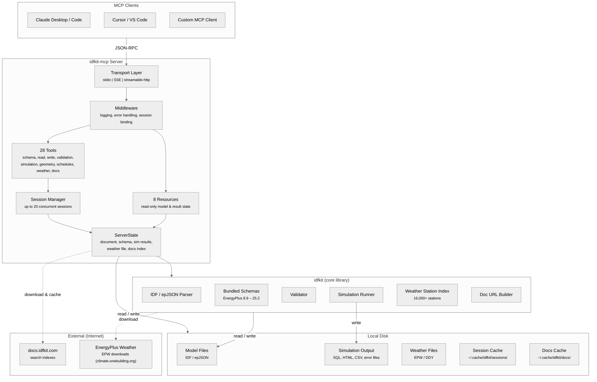
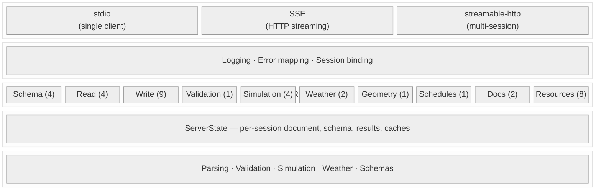
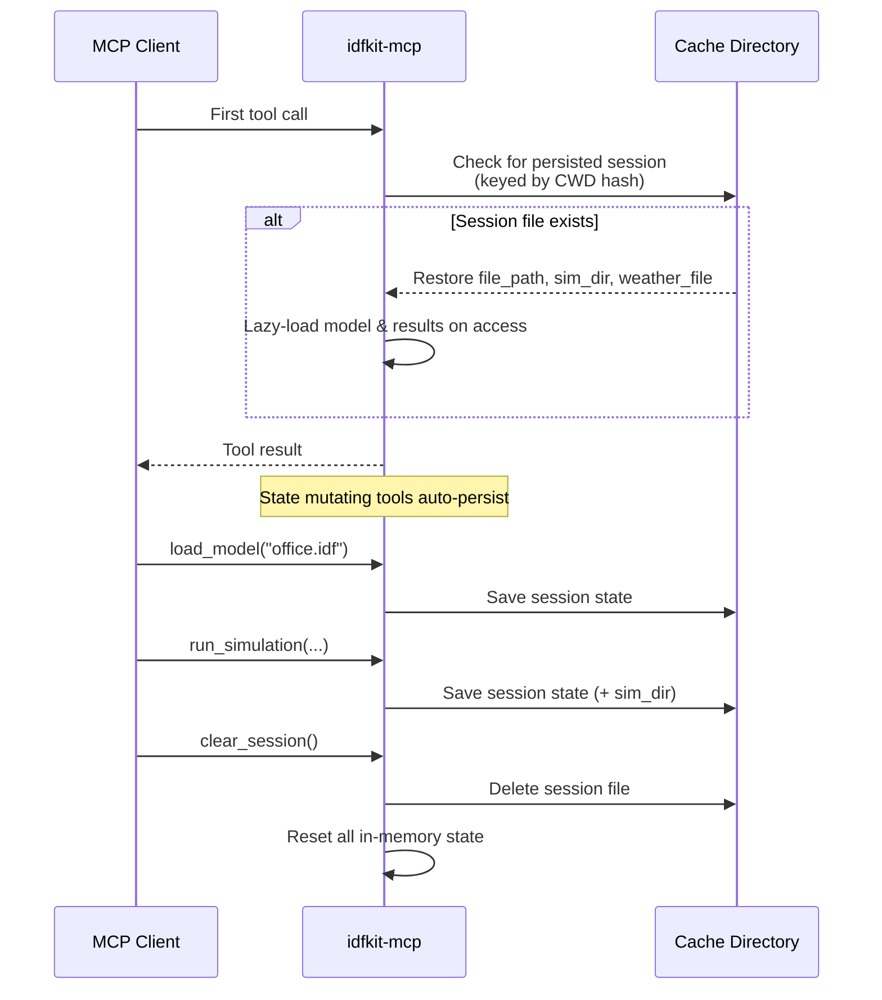
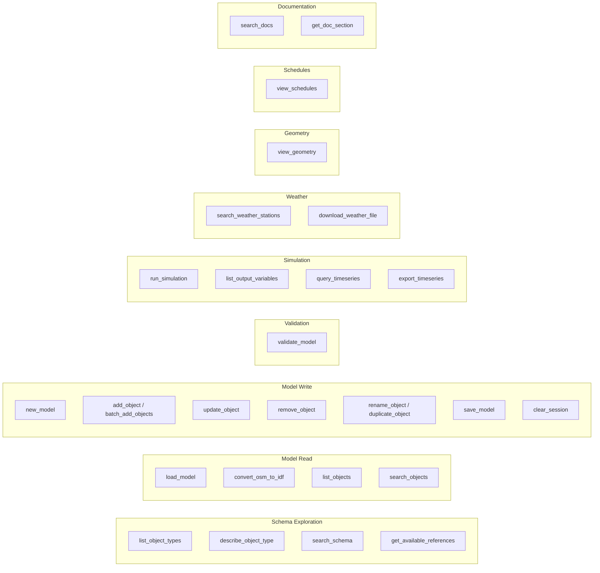
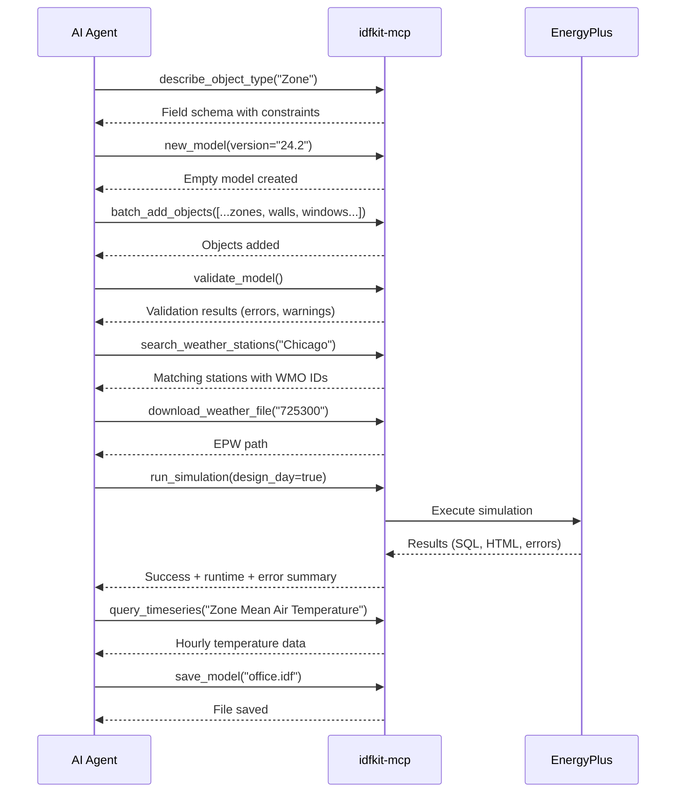

# System Architecture

This page describes how idfkit-mcp is structured, where data lives, and what crosses the network boundary.

## High-Level Overview

## Layered Architecture

The server is organized in four layers:

## Data Flow

### Where data lives

| Data | Location | Lifetime |
|------|----------|----------|
| EnergyPlus schemas (IDD/epJSON) | Bundled with idfkit | Permanent (per idfkit version) |
| Weather station index (16,000+ stations) | Bundled with idfkit | Permanent (per idfkit version) |
| Model files (IDF/epJSON) | User's filesystem | User-managed |
| Weather files (EPW/DDY) | `~/.cache/idfkit/weather/` or user path | Cached after download |
| Session state | `~/.cache/idfkit/sessions/<cwd-hash>.json` | Persists across restarts; cleared with `clear_session` |
| Documentation search index | `~/.cache/idfkit/docs/v{X.Y}/search.json` | Cached 7 days after download |
| Simulation output | Temp directory or user-specified path | Per-simulation run |

### What comes from the internet

Only two things are fetched over the network:

1. **Documentation search indexes** from `docs.idfkit.com` -- full-text search data for EnergyPlus I/O Reference and Engineering Reference. Downloaded once per EnergyPlus version and cached locally for 7 days.

2. **Weather files** (EPW/DDY) from the EnergyPlus weather repository. Downloaded on demand via the `download_weather_file` tool and cached locally.

Everything else -- schemas, station indexes, parsing, validation -- is fully offline using data bundled with idfkit.

### What requires a local installation

**EnergyPlus** must be installed locally to run simulations. The server discovers it by checking (in order):

1. `ENERGYPLUS_DIR` environment variable
2. System `PATH`
3. Standard OS install locations (`/usr/local/EnergyPlus-*`, `C:\EnergyPlusV*`, etc.)

Simulation is the only feature that requires EnergyPlus. All other tools (modeling, validation, schema exploration, weather search) work without it.

## Session Management

**Transport behavior:**

- **stdio** (Claude Desktop, Codex): Single session, persistence enabled. Session survives server restarts.
- **SSE / streamable-http** (multi-client): Up to 20 concurrent sessions keyed by `mcp-session-id` header. LRU eviction when full. Persistence disabled (sessions are ephemeral).

## Tool Categories

## Typical Workflow

